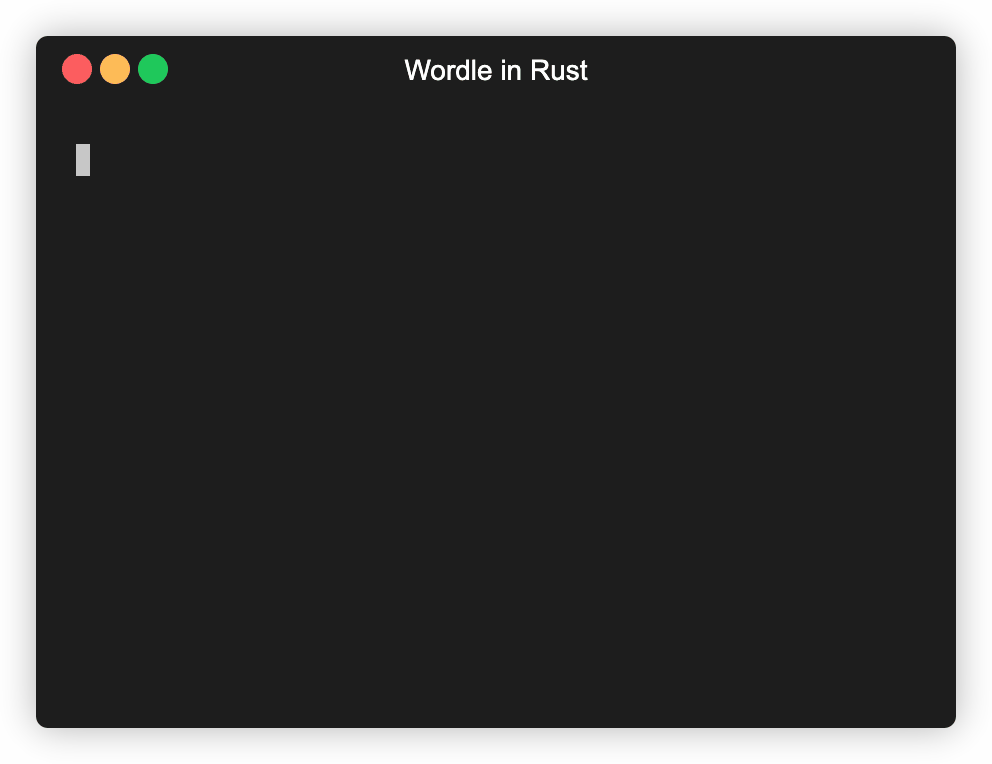

# Wordle in Rust

A Rust library and cli for [Wordle](https://www.powerlanguage.co.uk/wordle/).
Inspired by [Wordle in Bash](https://gist.github.com/huytd/6a1a6a7b34a0d0abcac00b47e3d01513)

## Install

```
cargo install wordler
```

## Play

```
wordler
```




## Basic Usage

```rust
use wordlers::dictionary::EnglishDictionary;
use wordlers::wordle::{Wordle, PlayResult};

let dictionary = EnglishDictionary::new().unwrap();
let mut wordle = Wordle::new(&dictionary);
let play_result = wordle.play("dream");
match play_result {
  Ok(play_result) => {
    println!("{}", play_result);
    match play_result {
        PlayResult::YouWon(_) => std::process::exit(0),
        PlayResult::YouLost(_) => std::process::exit(1),
        PlayResult::TurnResult(_) => {}
    }
  }
  Err(e) => println!("{}", e),
}
```
